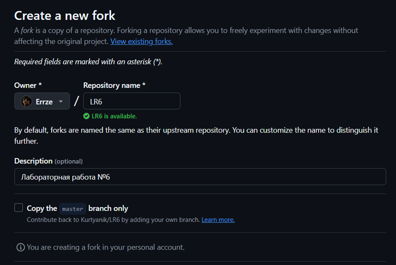
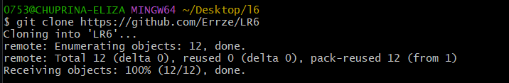
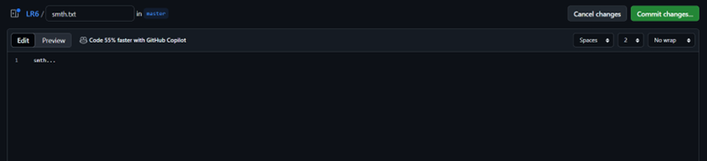
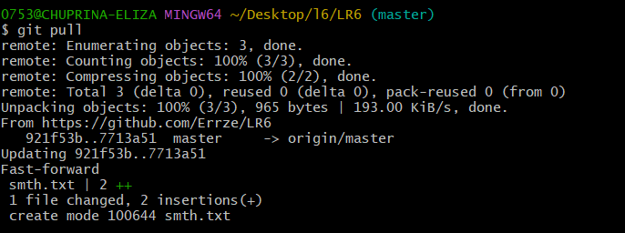
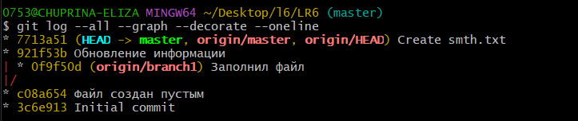
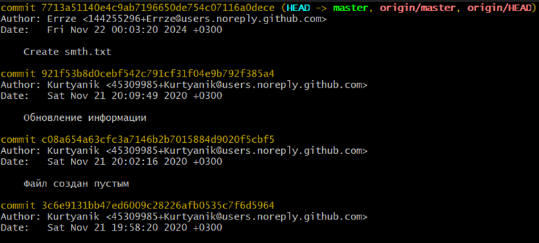
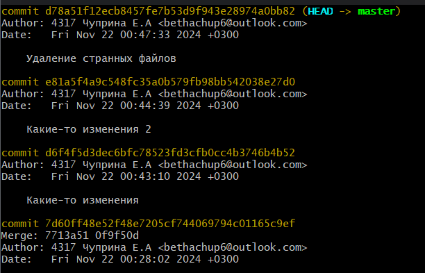
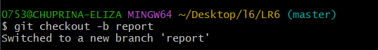
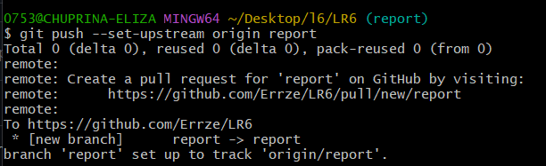
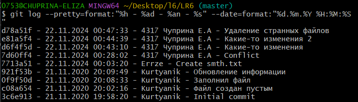

# Лабораторная работа №6 
# "Система контроля версий"

**Студент:** Чуприна Елизавета Александровна

**Группа:** 4317


# Цель работы 
Изучение базовых возможностей системы
управления версиями, опыт работы с Git Api, опыт работы с локальным и
удаленным репозиторием. 

# Ход работы
1. [Создание аккаунта на GitHub](README.md#Создание-аккаунта-на-GitHub)
2. [Форк преподавательского репозитория](README.md#Форк-преподавательского-репозитория)
3. [Установка клиента Git](README.md#Установка-клиента-Git)
4. [Клонирование репозитория на компьютер](README.md#Клонирование-репозитория-на-компьютер)
5. [Добавление нового файла через интерфейс. Изменения в локальный репозиторий](README.md#Добавление-нового-файла-через-интерфейс.-Изменения-локальный-репозиторий)
6. [История операций для веток](README.md#История-операций-для-веток)
7. [Просмотр последних изменений](README.md#Просмотр-последних-изменений)
8. [Слияние веток](README.md#Слияние-веток)
9. [Удаление побочной ветки](README.md#Удаление-побочной-ветки)
10. [Добавление изменений, коммиты](README.md#Добавление-изменений,-коммиты)
11. [Откат коммита](README.md#Откат-коммита)
12. [Создание новой ветки для отчета](README.md#Создание-новой-ветки-для-отчета)
13. [Лог команд](README.md#Лог-команд)
14. [История операций](README.md#История-операций)


# Создание аккаунта на GitHub
Создавать аккаунт не пришлось, ибо он существует уже с первого курса.

# Форк преподавательского репозитория
Форк делается на странице преподавательского репозитория



# Установка клиента Git
Установка и настройка так же не потребовались, ибо клиент имелся.

# Клонирование репозитория на компьютер
Клонирование выполняется с помощью команды:

`git clone https://github.com/Errze/LR6`



# Добавление нового файла через интерфейс. Изменения в локальный репозиторий
Изменения подтягиваются с помощью команды:

`git pull`





# История операций для веток
Историю можно получить с помощью команды:

`git log --all --graph --decorate --oneline`



# Просмотр последних изменений
Просмотр истории изменений осуществляется за счет команды:

`git log`



# Слияние веток
Слияние веток происходит с помощью команды:

`git merge origin/branch1`

Возникающий конфликт был решен изменением файла.

# Удаление побочной ветки
Удаление ветки происходит с помощью команды:

`git push origin --delete --remote origin/branch1`

# Добавление изменений, коммиты
Были добавлены некоторые изменения. Пара новых строчек в одном файле, создание другого файла.

# Откат коммита
Откат коммита осуществляется с помощью команды: 

`git reset HEAD~1`



# Создание новой ветки для отчета
Создание новой ветки осуществляется с помощью команды:

`git checkout -b report`

`git push --set-upstream origin report`





# История операций
История операций выводится в необходимом формате с помощью команды:

`git log --pretty=format:"%h - %ad - %an - %s" --date=format:"%d.%m.%Y %H:%M:%S"`



# Лог команд

```
git pull 
git log --all --graph --decorate --oneline
git log
git merge origin/branch1
git push origin --delete --remote origin/branch1
git reset HEAD~1
git checkout -b report
git push --set-upstream origin report
git log --pretty=format:"%h - %ad - %an - %s" --date=format:"%d.%m.%Y %H:%M:%S"
```


# Выводы
При выполнении лабораторной работы были изучены базовые возможности системы
управления версиями, был приобретен начальный опыт работы с Git Api, опыт работы с локальным и
удаленным репозиторием. 
